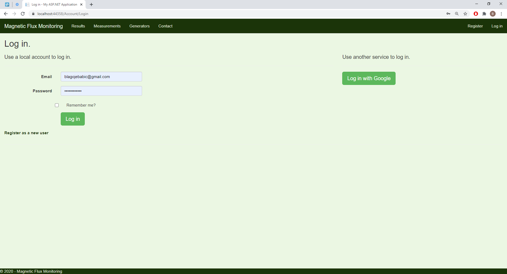
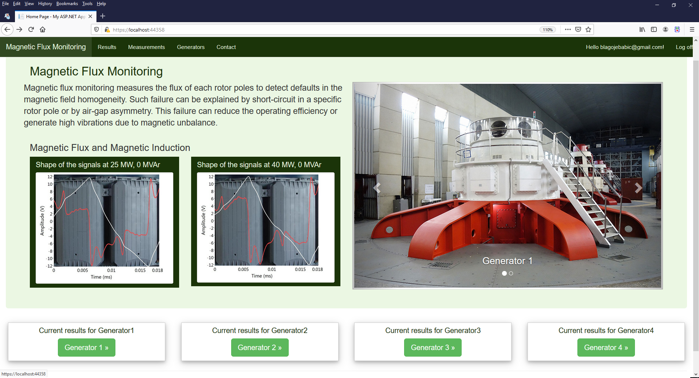
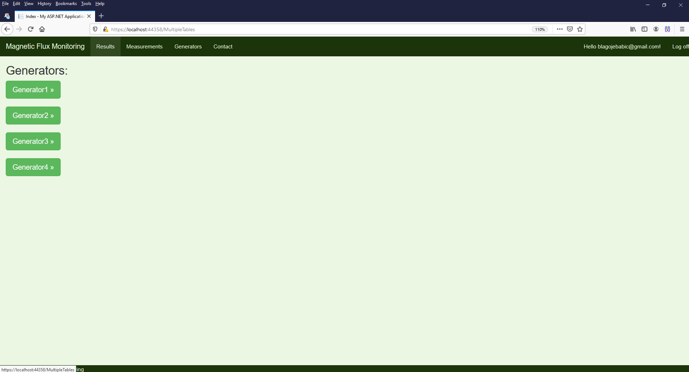
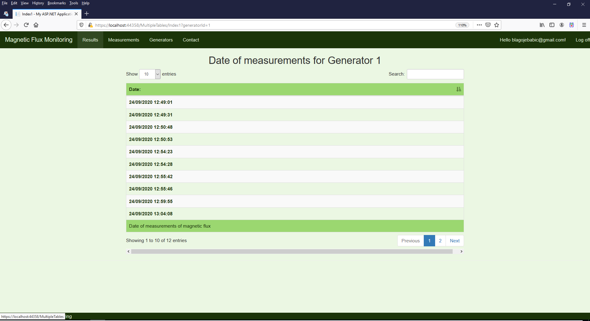
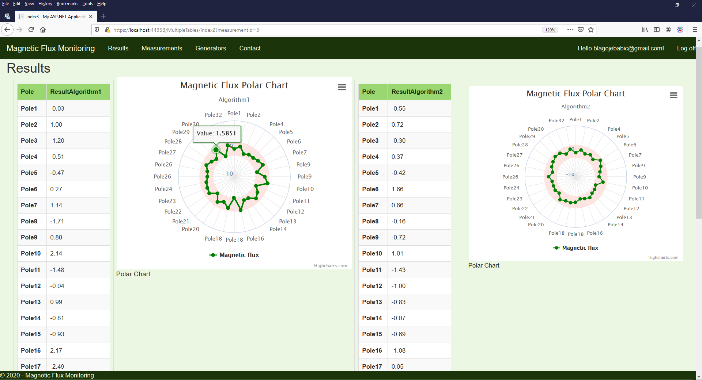
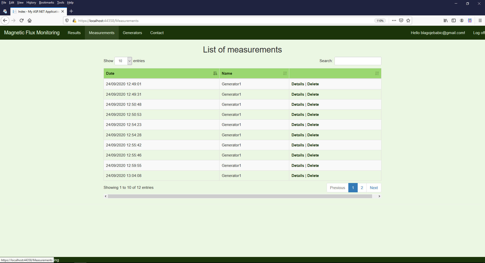
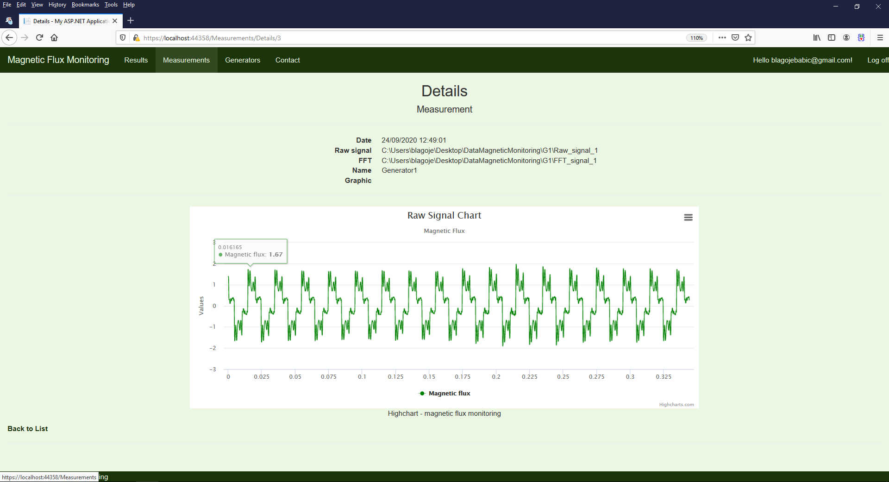
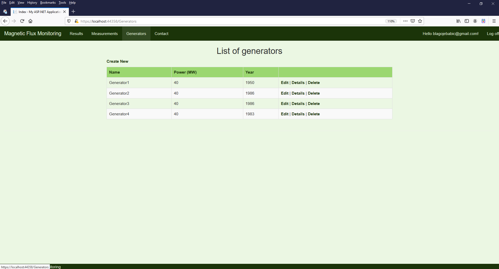
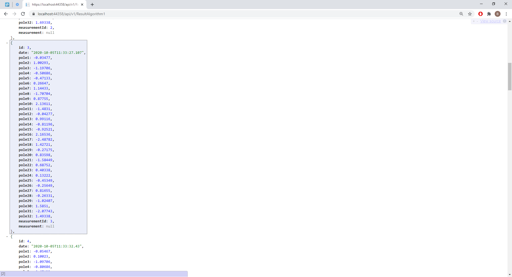
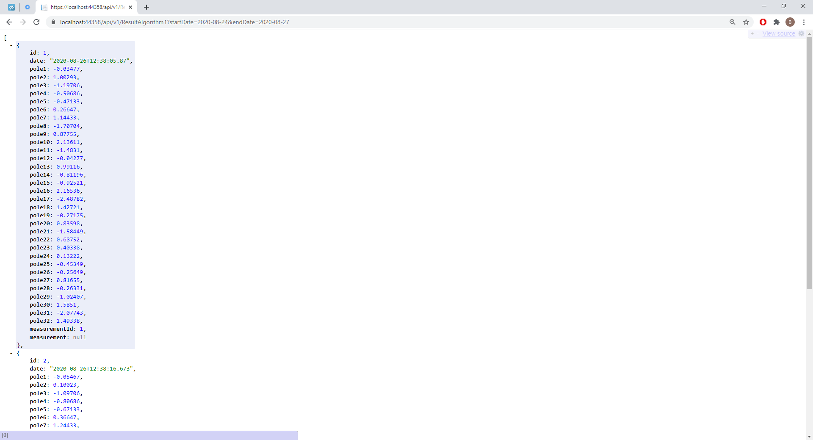

# Magnetic Monitoring of Generators - ASP.NET MVC, ASP.NET Web API, jQuery, Bootstrap, SQL 

**About this app:** The application provides instant analysis of the magnetic flux in the generator to indicate the presence and location any rotor poles with shorted turns. Entity Framework Database First Approach was used to interact with the SQL Server database. A REST API enables registered users to access and use data (results of magnetic flux processing). ASP.NET Web API Google authentication is also implemented.

## Screenshots

###### Login Page

###### Main Page

###### List of Generators

###### List of Measurements - Generator No. 1

###### Magnetic Flux Processing Results

###### List of Measurements for all Generators

###### Raw Data - Details

###### Edit Data in DB

###### Web API response 

###### Web API response - for certain dates

